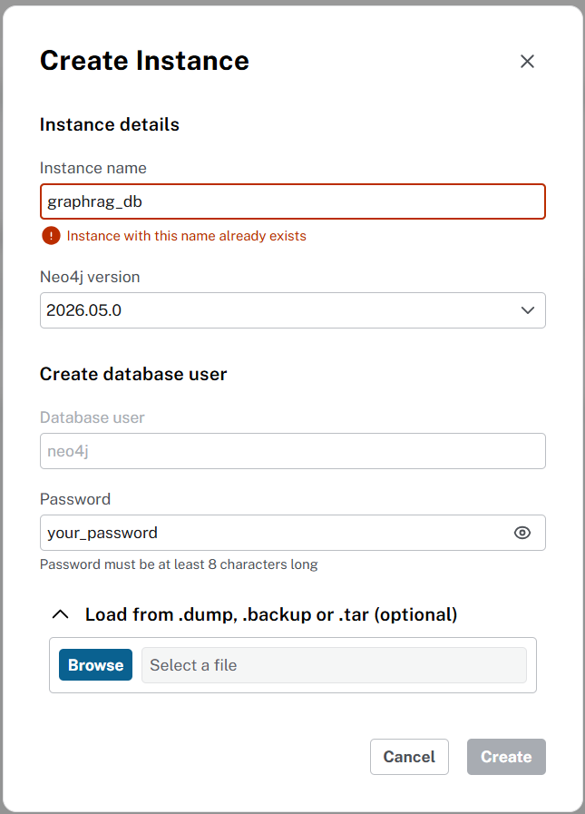

# Embedding-RAG, SQL-RAG, and Graph-RAG

This project provides a framework to compare three Retrieval-Augmented Generation (RAG) strategies for structured data:

- **Embedding-RAG**: Uses vector embeddings and similarity search over metadata.

- **SQL-RAG**: Translates natural language queries into SQL statements for relational databases.

- **Graph-RAG**: Converts queries into Cypher statements for graph databases.

It supports both a Streamlit chatbot UI and a CLI pipeline for batch testing and evaluation.

## Project Context

This repository is part of my **Final Year Project** at Universiti Malaysia Sarawak (UNIMAS).  
It implements and evaluates three Retrieval-Augmented Generation (RAG) strategies — **Embedding-RAG**, **SQL-RAG**, and **Graph-RAG** — on structured data.  
The project provides a unified framework with both an interactive Streamlit chatbot UI and a CLI pipeline, enabling systematic comparison across context relevance, groundedness, and answer relevance.  

## Pre-requisites

- **Python 3.12+**

- **Ollama** (for running open-source LLMs) → https://ollama.com/download/

- **Neo4j** with the **APOC plugin** → https://neo4j.com/download/


## Installation

Clone the repository:

```bash
git clone https://github.com/your-repo/rag-project.git
cd evaluating-rag
```

Create and activate a virtual environment:

```bash
python -m venv venv
venv\Scripts\activate.bat
```

Install dependencies:

```bash
pip install -r requirements.txt
```

Set up environment variables in a `.env` file:

```bash
EMBDRAG_DATABASE=data/embdrag_db
SQLRAG_DATABASE=data/sqlrag_db
SCHEMA=src/conf/schema.json

OLLAMA_MODEL=gemma4:31b-cloud
CLOUD_MODEL=qwen3.5:397b-cloud
VISION_MODEL=qwen3-vl:235b-cloud
EMBEDDING_MODEL=qwen3-embedding:0.6b

LANGSMITH=False
LANGSMITH_API_KEY=
LANGSMITH_PROJECT=
FEW_SHOT=3

NEO4J_URI=bolt://localhost:7687
NEO4J_USERNAME=neo4j
NEO4J_PASSWORD=your_password
```

Run the database initialization script:

```bash
python data/create_db.py
```

Load the graph database manually:

1. Open Neo4j Desktop and create a new database instance.

2. Choose “Load from .dump, .backup or .tar (optional)” and select data/neo4j.dump.

3. Create and start the database instance.



## Usage

### 1. Streamlit Frontend (Interactive Chatbot)

Run the chatbot UI:

```python
streamlit run ui.py
```

### 2. CLI Mode (Batch Testing)

Run the CLI script to generate answers for all three RAG strategies and save results to `results.csv`:

```python
python main_cli.py
```

### 3. Evaluation (LLM-as-a-Judge)

Run the evaluator to score each tested question using an LLM-as-a-Judge approach:

```python
python src/evaluator.py
```